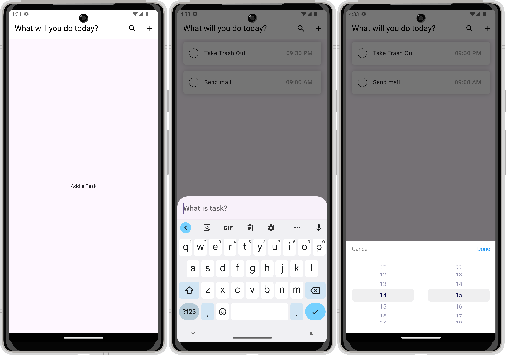
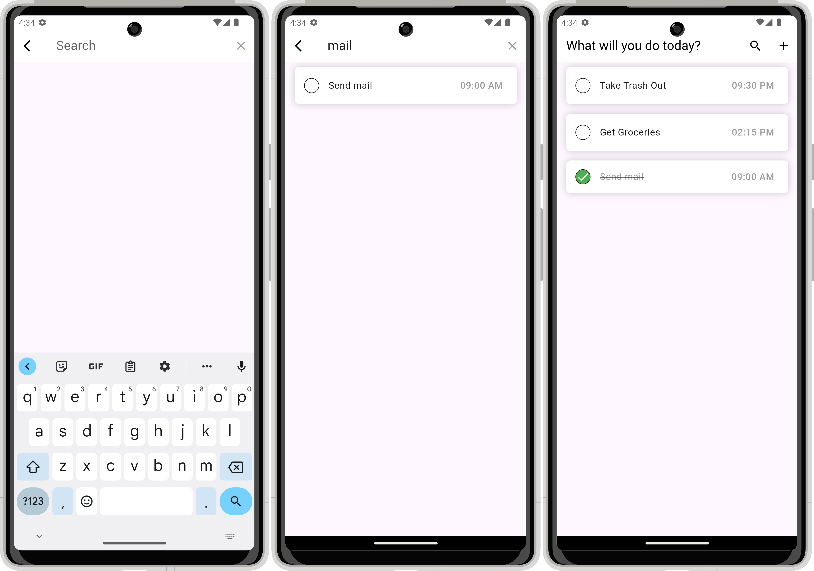

# ToDo App

ToDo Application

 
 

## Built With 

- [Flutter&Dart](https://docs.flutter.dev/get-started/codelab)
- [Basic Widgets](https://docs.flutter.dev/ui/widgets/basics)
- [Material Component Widgets](https://docs.flutter.dev/ui/widgets/material)
- [Async Widgets](https://docs.flutter.dev/ui/widgets/async)
- [Hive](https://pub.dev/packages/hive)
- [GetIt](https://pub.dev/packages/get_it)
- [Intl](https://pub.dev/packages/intl) 
- [EasyLocalization](https://pub.dev/packages/easy_localization)
- [DateTimerPickerPlus](https://pub.dev/packages/flutter_datetime_picker_plus)
- [Uuid](https://pub.dev/packages/uuid)